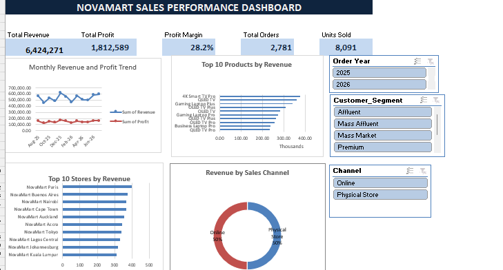
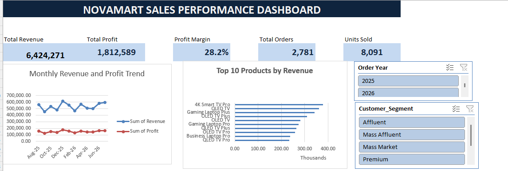
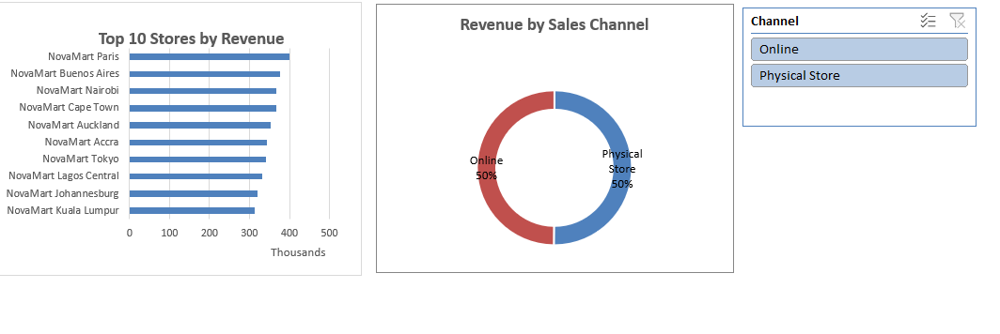
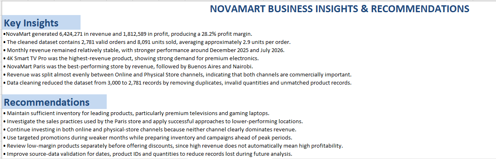

# NovaMart Sales Performance Analysis

## Project Overview

This project analyzes NovaMart’s sales performance from August 2025 to July 2026. Using Excel and Power Query, I cleaned and transformed the raw data, created calculated business metrics, and developed an interactive dashboard to help decision-makers monitor revenue, profitability, product performance, store performance, and sales channels.

## Business Objectives

The analysis answers the following questions:

* What are NovaMart’s total revenue, profit, profit margin, orders, and units sold?
* How do revenue and profit change over time?
* Which products generate the most revenue?
* Which stores perform best?
* How is revenue distributed between online and physical-store channels?
* What actions could improve future sales performance?

## Tools and Skills

* Microsoft Excel
* Power Query
* PivotTables and PivotCharts
* Data cleaning and transformation
* Data modelling and table merging
* KPI calculation
* Dashboard design
* Slicers and interactive filtering
* Business insight generation

## Data Preparation

The original dataset contained 3,000 sales records. The following cleaning and transformation steps were completed:

* Removed 19 duplicate records
* Removed 18 records with invalid quantities
* Removed 182 records with unmatched product IDs
* Retained unmatched customer and store records under the `Unknown` category
* Standardized text fields and date formats
* Merged sales data with product, customer, and store tables
* Created Revenue, Cost of Goods Sold, Profit, Profit Margin, Order Year, and Order Month fields

After cleaning, 2,781 valid sales records remained for analysis.

## Key Performance Indicators

| KPI           |    Result |
| ------------- | --------: |
| Total Revenue | 6,424,271 |
| Total Profit  | 1,812,589 |
| Profit Margin |     28.2% |
| Total Orders  |     2,781 |
| Units Sold    |     8,091 |

## Dashboard

The dashboard includes interactive slicers for Order Year, Customer Segment, and Sales Channel.

### Dashboard Detail

## Key Insights

* Monthly revenue remained relatively stable, with stronger performance around December 2025 and July 2026.
* The 4K Smart TV Pro generated the highest product revenue, indicating strong demand for premium electronics.
* NovaMart Paris was the highest-performing store by revenue, followed by Buenos Aires and Nairobi.
* Revenue was divided almost evenly between online and physical-store channels, showing that both channels are commercially important.
* The average order contained approximately 2.9 units.
* Data cleaning reduced the dataset from 3,000 to 2,781 valid records.

## Recommendations

* Maintain sufficient inventory for high-performing products, particularly premium televisions and gaming laptops.
* Investigate the practices used by the Paris store and apply successful approaches to lower-performing locations.
* Continue investing in both online and physical-store channels because neither channel clearly dominates revenue.
* Use targeted promotions during weaker months while preparing inventory and campaigns ahead of stronger periods.
* Review low-margin products before offering discounts, because high revenue does not automatically indicate high profitability.
* Strengthen source-data validation for dates, quantities, and product IDs to reduce records lost during future analysis.

## Insights and Recommendations Sheet

## Repository Contents

* `NovaMart_Business_Case_Dataset Final.xlsx` — cleaned data, Power Query transformations, PivotTables, dashboard, and insights
* `images/` — dashboard and insights screenshots
* `README.md` — project documentation

## Author

**Mitchell Wambui Wangui**  
Accounting and Finance Professional| Data Analyst
